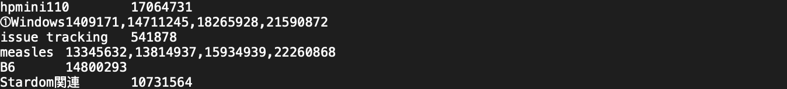
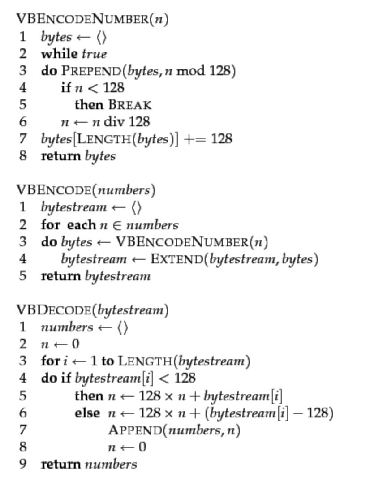

# [Chapter 6] 압축 프로그래밍 - 데이터 크기, I/O 고속화의 관계 인식하기

## Chapter6 의 목표

- 압축과 I/O의 고속화는 끊을 수 없는 관계임을 이해한다.
- VB Code(Varible Byte Code) 라는 알고리즘을 예로 들어 정수열 압축 프로그래밍을 한다.

## 정소 데이터를 컴팩트하게 가져가기

### 목표

<aside>
📖 정수열이 기록된 CSV를 바이너리로 해서 컴팩트하게 가져가기

</aside>

- 정수의 부호화를 연구해서 텍스트로 152MB인 CSV 데이터를 절반 이하의 크기로 압축, 원복을 복원할 수 있어야함
- [자료 다운로드 하기](https://gihyo.jp/book/2010/978-4-7741-4307-1/support#supportDownload)(아래의 부호화/복호화 코드 포함)

---

### 이 과제를 풀면 어떤 점이 좋을까

- 큰 데이터 압축
    - 디스크 I/O를 줄일 수 있다. ⇒  고속처리
    - RDBMS에 저장하면 크기가 늘어나는 데이터를 최소한의 크기로 줄여서 다룰 수 있다.
- VB Code의 속도감 파악
    - 빠른 프로그램의 속도는 어느 정도 인지 파악 가능
- 데이터 형의 크기 등에 의식을 갖는다.
- 응용
    - 제 9장 ,제 10장의 검색엔진 개발에 응용
    - 기계 학습이나 데이터마이닝 등에서 거대한 정수열을 다룰 일이 많다.

---

### 과제에서 다루는 파일의 내부

 

- 특정 태그가 있고, 그 태그를 포함하는 엔트리의 ID 기록

## VB Code와 속도감각

### VB Code (Varible Byte Code, 가변길이 바이트 부호)

- 정수열 압축 알고리즘 (그 외로 Golomb 부호 및 Interpolate (보간) 부호 등 …)
- 구현면에서는 간단하고 속도가 빨라 쉽게 사용할 수 있다.
- 정수의 부호화 방법 중 하나

| 수치 | 고정 길이 바이너리 부호 | VB Code |
| --- | --- | --- |
| 5 | 00000000 00000000 00000000 00000101 | 10000101 |
| 130 | 00000000 00000000 00000000 10000010 | 00000001 10000010 |
- 5의 경우, 00000000(8비트) 00000000(8비트) 00000000(8비트) 00000101(8비트)  ⇒ 총 32비트, 4바이트나 되지만 하위 1바이트(8비트) 이외에 사용하지 않는다.
- **앞부분에서 사용하지 않는 바이트를 제거하고 최소한의 바이트로 정보를 표헌하는 것**

| 수치 | VB Code |
| --- | --- |
| 5 | 10000101 |
| 130 | 00000001 10000010 |
- 첫 비트 : 이 정수의 비트열은 **이 바이트에서 끝이라는 플래그**
- 각 바이트 8비트의 첫 1비트는 플래그이므로 정수를 표헌하는 부분으로는 7비트만 사용가능
- ex) 수치 130 복호화
    - 첫 비트는 0이므로 이 바이트에서 끝나지 않는다.
    - 이 첫 바이트 끝에 하위 7비트인 1이 있음을 기억해보자
    - 다음으로 넘어가면서 두 번째 바이트에 첫 비트까 1이므로 이 정수는 이 바이트에서 끝이라는걸 의미
    - 즉, 첫 번째 바이트 하위 7비트는 128을, 2바이트째는 하위 7비트가 2를 나타내므로 128 + 2 = 130으로 복호화
- 1바이트 째의 하위 7비트로는 0 ~ 127까지를 나타내고, 그 상위 바이트는 128 * (1 ~ 127), 그 상위는 128^2 ( 1 ~ 127) … 을 나타낸다.
- 결론적으로 보면 5의 경우 4바이트를 1바이트가 되었고 , 130은 4바이트에서 2바이트로 압축되었다.
- **값이 작으면 작을 수록 적은 바이트로 정수를 표현할 수 있는 것이 가변 길이인  VB Code이다.**

---

### VB Code의 의사코드

 

- [자세히](https://nlp.stanford.edu/IR-book/html/htmledition/variable-byte-codes-1.html)

---

### 정렬 완료된 정수를 ‘Gap’으로 가져가기 - 정수열 압축

- 정수가 차분(두 정수간의 차이)를 구해서 작은 정수로 표현되도록 바꾸는 것
- 태그 데이터를 잘 살펴보면 오름차순으로 정수가 정렬되어 있다.

```java
[3, 5, 20, 21, 23, 76, 77, 78] ⇒ [3, 2, 15, 1, 2, 53, 1, 1] 
```

- 정수로 정렬이 되어있다면 반드시 단순 증가한다는 것을 보장
- 단순 증가하게 되면 처음부터 차분을 구하더라도 역으로 복원할때 처음부터 더해가면 원래 정수열로 복원할 수 있다.
- 따라서 특정 정수를 표현할 때 바로 **이전 숫자와의 차분으로 표현**해준다.

(직감적으로 왼쪽 열보다 오른쪽 열이 압축하는 편이 압축률이 높아질 거라는건 직감적으로 알 수 있다)

- 단순 증가하는 정수열의 차(Gap)를 구해서 VB Code 부호화하는 것이 정수열을 압축하는 방법

---

- 보충 1 : 압축의 기초
    - 기호의 확률분포를 바탕으로 **자주 나타나는 기호에는 짧은 부호를, 그렇지 않은 기호에는 긴 부호를 부여**  ⇒ 모스 신호와 같은 원리
        - 압축의 가장 근저에 있는 이론
        - ex ) e나 t와같이 자주 쓰이는 영어는 짧게 전달 , z 와 q 등 별로 나타나지 않는 건 긴 부호로 신호 할당
        - 압축도 이와 같은 개념 , 모든 기호에 같은 길이 부여 x → 많이 출현하는 것에 짧은 부호 할당 적게 출현하는것에 긴 부호 부여
        - **정수의 값을 Gap을 취하여 작은 숫자가 많이 나타나기 쉽도록 확률분포를 만들고 , 이에 대해 작은 정수에 짧은 부호를 부여하는 VB Code를 적용함으로써 압축**
- 보충 2:  대상이 정수인 경우 - 배경에 있는 이론
    - 텍스트를 압출 할 때 범용적인 압축방법 : ex) 허프만 부호(Huffman Code)
    - 대상이 정수인 경우
        - 압축대상인 기호 자체가 정수로서 의미를 지니고 있다.
        - 정수라는 특징을 잘 이용해서 압축한다.

## 과제에 대한 상세설명과 응답 사레

### 과제에 대한 상세 설명

1. 테스트용 데이터 파일을 Gap + VB Code로 부호화한 것을 저장하는 프로그램을 만든다.
2. 저장한 바이너리를 복원하는 프로그램을 만든다.
3. 원복 텍스트 파일보다 얼마나 작아졌는지를 확인
4. 수활하게 끝낸사람 →  VB Code 이외의 부호화 하는 방법 시험 

### pack() 함수 / unpack() 함수

- pack () : 데이터를 바이트 형식으로 인코딩
- unpack() : 바이트 형식의 데이터를 디코딩

```perl
my $bin = pack('N*' , 1,2,5,8,10)  => long형 정수 5개를 바이너리로
my $c = pack('C*' , 1,2,5,8,10)  =>  각 1바이트 (unsigned char)로 바이너리
my @v = unpack('N*' , $bin) => Perl 표현(배열)로 되돌린다.
```

- **`'N*'`** 포맷 문자열은 빅엔디안 형식의 unsigned long들을 묶는 것을 의미합니다. **`N`**은 unsigned long을 나타내고, **`*`**는 여러 개의 숫자를 묶음을 의미합니다.
- 어디서 사용 ? :
    1. VB Code로 바이트열을 생성하는 부분
    - 마지막 의사코드에서 바이트열을 복수의 배열 그대로 함수에 반환 하는 형태로 되어있다. 그렇게 되면 바이트열을 그대로 파일에 쓸 수 없으므로 반환할 때 unsigned char로 pack해서 단일 바이너리로 만들어야한다.
    1. 바이너리를 Read/Write 할 때
    - 텍스트 (태그 부분)와 압축한 정수열 , 즉 바이너리를 둘 다 출력하게 된다. 즉 태그의 텍스트 → 바이너리 형태가 하나의 레코드가 되버림.
    - 텍스트 /  바이너리 간 구분  : 레코드를 구분할 수단 필요
    - 바이너리의 경우 데이터를 구분하는 데 탭이나 개행문자를 사용할 수 없다.
    - 정수를 부호화 하면 부호 내에 텍스트로 탭이나 개행에 해당하는 부호가 나타남
    - 그러니 어디부터 어디까지가 char이모 VB Code인지 알 수 없음
    - 각 데이터의 데이터 길이를 데이터와 함께 덧붙여서 쓰고 읽어들인다.

```perl
#write
print pack ('N2'), length($tag) , length($v)) , $tag , $v

$v : VB Code로 부호화된 바이너리
N2 : unsinged long형 정수 
=> length()로 얻은 $tag 길이와 $v의 길이, 두 정수를 바이너리로 변환
=> 데이터가 시작되지 전에 반드시 길이가 기록됨

#read
$fh -> read(my $buff, 8) or last;
my ($len_t, $len_v) = unpack('N2', $buff); -> 바이너리 데이터를 Perl로 출력표현으로 되돌림 (데이터 길이 얻음)
$fh -> read(my $tag, $len_t); -> 데이터 길이 만큼 읽어준다.
$fh -> read(my $v, $len_v)
```

### 프로파일링

- 자신이 구현한 결과물의 속도가 실제 어느 정도 인지 확인할때 프로파일러 사용 : Devel::NYProf

### 응답 사례와 사고 방식

`vb_encode.pl (압축/부호화)`

```perl
#!/usr/bin/env perl
use strict;
use warnings;
use FindBin::libs;

use VB;
use Path::Class qw/file/;

my $file = shift or die "usage: %0 <data file>\n";

my $fh = file($file)->openr;

while (my $line = $fh->getline) {
    my ($tag, $nums) = split "\t", $line;

    ## 정수열의 차분을 얻고 VB Code로 부호화
    my $vb;
    my $pre = 0;
    for (split ',', $nums) {
        $vb .= vb_encode($_ - $pre);
        $pre = $_;
    }

    ## $tag, $vb의 길이를 pack()으로 덧붙여가며 출력
    print pack('N2', length($tag), length($vb)), $tag, $vb;
}
```

`vb_decode.pl(복호화)`

```perl
#!/usr/bin/env perl
use strict;
use warnings;
use FindBin::libs;

use VB;
use Path::Class qw/file/;

my $file = shift or die "usage: %0 <binary file>\n";

my $fh = file($file)->openr;

while (1) {
    ## 태그, VB 부호화 부분의 길이를 읽어들인다.
    ## 8바이트 = 32비트 + 32비트
    $fh->read(my $buf, 8) or last;
    my ($tlen, $vblen) = unpack('N2', $buf);

    ## 일어들인 길이만큼 태그, VB 부호화 부분을 읽어들인다.
    $fh->read(my $tag, $tlen);
    $fh->read(my $vb, $vblen);

    ## VB Code로 복호화 하고 차분이었던 값을 원래대로 되돌린다.
    my @nums;
    my $pre = 0;
    for (vb_decode($vb)) {
        push @nums, $pre + $_;
        $pre += $_;
    }

    ## 원래 포맷에 맞게 출력
    printf "%s\t%s\n", $tag, join ',', @nums;
}
```

- 기타 (의사코드) - 파이썬
    
    [https://gist.github.com/RyanKor/74034b5a0c0d4702bdff12b3c654c3e7](https://gist.github.com/RyanKor/74034b5a0c0d4702bdff12b3c654c3e7) (의사코드 - 파이썬)
